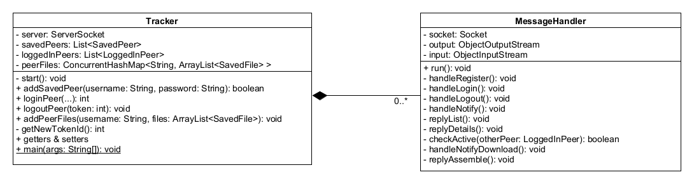
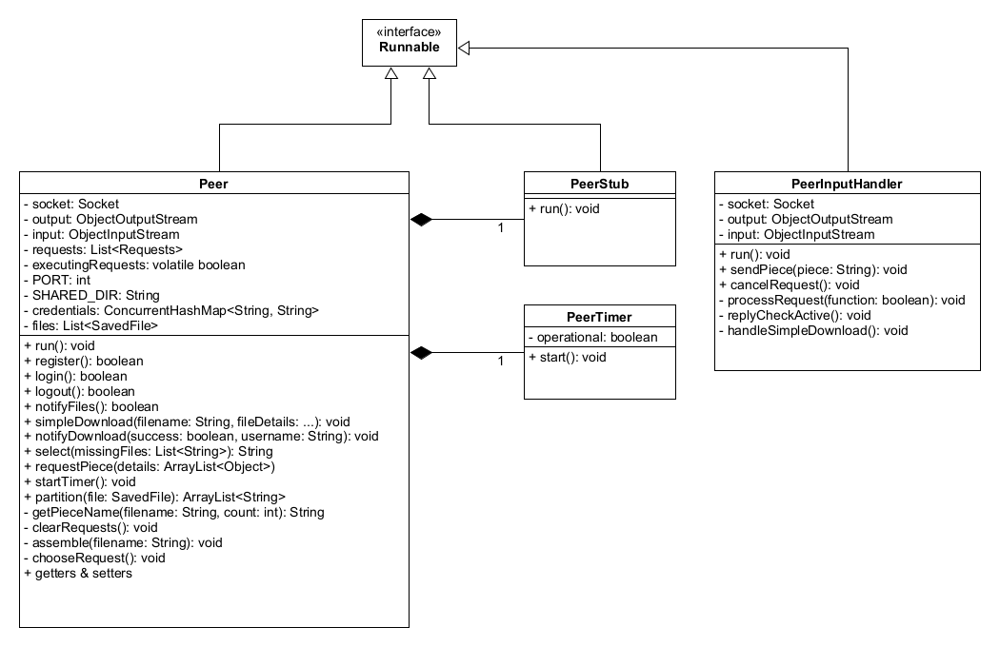
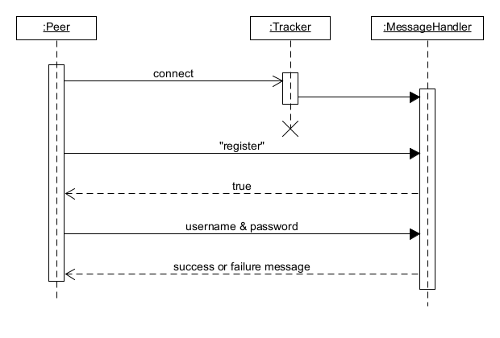
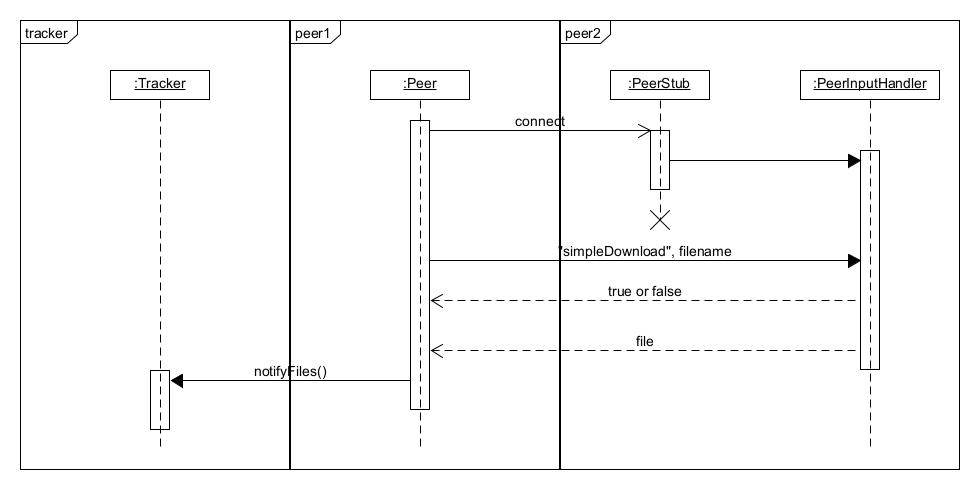
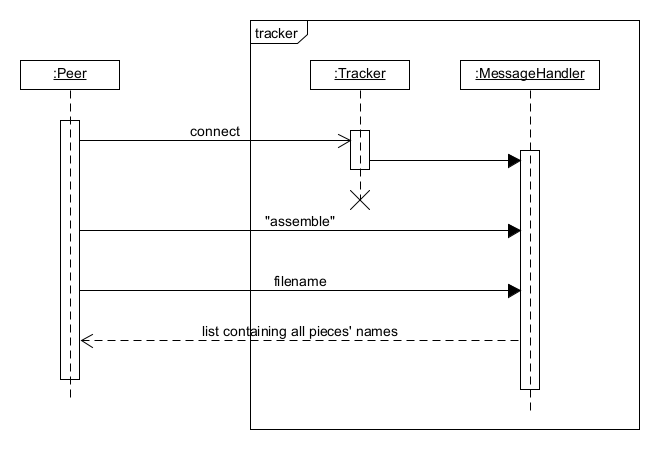

# P2P

The following document describes the inner workings of an assignment I completed for my university during my third year. The goal of the current assignment is the construction of a *peer-to-peer network* monitored by a central *tracker* server.

### Technologies used

The implementation of this project requires only [Java 11](https://www.oracle.com/java/technologies/javase-jdk11-downloads.html).

### Architecture

#### Entities

| **Entity** | **Brief description** |
| :--------: | --------------- |
| Tracker    | The tracker is a single object monitoring the various communications between the peer entities. The tracker also holds information about the location of all files and fragments inside the network.
| Peer       | A peer constitutes a small part of the network which is capable of storing files and file fragments as well as downloading files from other peers. |

##### Tracker

The tracker consists of the *Tracker* class and the *MessageHandler* class. The *Tracker* class stores the information about every peer that ever registered, every peer that is currently active and the files each peer has. A peer's successful and unsuccessful attempts to seed a file are also documented at the tracker. A *MessageHandler* instance is created by the *Tracker* every time a new connection reaches the tracker at port **55217**. The *MessageHandler* class is a thread that manages a single connection up until it terminates.

The tracker is initiated using the following terminal command: `java Tracker`.

##### Tracker class diagram

*Note: The SavedPeer, LoggedInPeer and SavedFile classes are storage containers for peer-related data.*

##### Peer

The Peer entity is made from the following classes: *Peer*, *PeerStub*, *PeerTimer* and *PeerInputHandler*. The *Peer* class is the main part of the peer entity. A single *PeerStub* and one *PeerTimer* exist inside a *Peer* class instance.

The *PeerStub* instance acts as a container for the server socket which receives connections from other peers or the tracker. After a successful connection, the peer stub creates a *PeerInputHandler* thread to look after the connection. The *PeerInputHandler* can perform a the following operations:

* Respond to requests that wish to determine the peer's status(check-active-requests).
* Send a small file(less than 1 MB in size) to another peer.
* Seed a piece belonging to a file which the peer possesses in their entirety.

A peer's available files(including the downloaded ones) are stored in the *shared_dir/<peer_name>/* directory, where *<peer_name>* refers to the name used to register at the tracker.

A *PeerFactory* is used to create many peers using the following command: 
`java PeerFactory <peer_number>`, where *<peer_number>* refers to the number of peers to be created.

##### Peer class diagram

#### Seeding

Currently, the project is setup so that all peers attempt to download all files that exist in the network. Files bigger than 1 MB are partitioned into 1 MB pieces. Each peer gets informed by the tracker about the pieces he does not possess and then requests a piece at random by one of it's seeders. A **seeder** is a peer that fully possesses a specific file. When the seeder receivers a requests, it initiates its *PeerTimer*.

Every time the *PeerTimer* ticks, a random requests gets executed. That means, that the seeder sends a piece it possesses to another peer which has requested that piece. If a peer successfully downloads all the pieces belonging to a file, it **assembles** the pieces into a single file and becomes one of its seeder.

#### Examples

##### Peer registration

##### Simple download

##### Assemble

